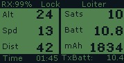

Common Failsafes
================

GPS lock/HDOP
^^^^^^^^^^^^^

GPS lock/HDOP: This  error results from obstructed vision to the sky (thus too few satellite locks). In order to pass the HDOP or GPS lock failsafes move the Iris + to an area with high sky visibility. Once the Iris + has five or more satellite locks it should no longer give this error (See Sats on the RC controller digital readout).

Bad Velocity
^^^^^^^^^^^^

Bad Velocity: This error results from the Iris + being connected (plugging in the battery) on an inclined surface. The vehicle will not pass this failsafe until connected on a flat surface.

Gyro Cal Failed
^^^^^^^^^^^^^^^

Gyro Cal Failed: This error results from the Iris + being moved during startup. Generally this failsafe will occur after the battery is plugged in and the user forcefully closes the rear battery compartment. Common practice is to plug in the battery and not close the battery hatch until the rear LED is green.

Proper Startup Procedure
^^^^^^^^^^^^^^^^^^^^^^^^

1. Take the Iris + to an open area with clear view of the sky.
2. Place the Iris + on level ground and open up the battery compartment.
3. Connect the battery and wai tuntil the rear LED turns to green.
4. Close the battery compartment and prepare to arm the motors.
