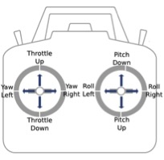

RC Controller
=============

Manual Controls
^^^^^^^^^^^^^^^

The Iris + can always be manually controlled no matter what flight mode it is in. 

In order to arm the Iris for flight: 

1. All safety checks must be passed (:ref:`Failsafes`) 
2. The safety button must be solid red
3. The rear LED must be flashing green (black legs signify backside)
4. Return to Launch (RTL) is off

Once the Iris is ready to be armed and all personnel are a safe distance away you will move the **left** stick to the **bottom-right** hand corner (throttle down & yaw right). The propellers will begin to spin and you will be ready for flight. For non-flight testing purposes make sure propellers are not on the quadcopter.

Switching Modes
^^^^^^^^^^^^^^^

* You are able to switch between flight modes mid-flight by flipping the switch with labels STD, LTR, AUTO (:ref:`Flight Modes`)
* The RTL switch will cause the IRIS to return to its original launch position and land.
* The CH7 (Channel 7) switch will cause the Iris to land in its current position.
